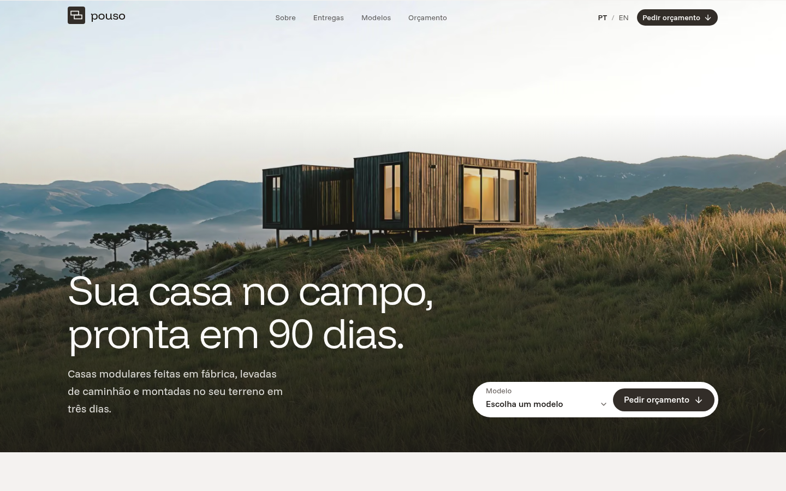

<div align="center">

# Pouso

### Casas modulares para o campo

_Landing page de uma fabricante de casas modulares: módulos feitos em fábrica, levados de caminhão e montados no terreno em três dias_

#### [Link da demo](https://pouso-homes.vercel.app/)

---

[](https://nextjs.org/)
[](https://react.dev/)
[](https://www.typescriptlang.org/)
[](https://tailwindcss.com/)

</div>

---



## ✨ Sobre o Projeto

**Pouso** é a landing page de uma fabricante fictícia de casas modulares para o campo. Os módulos de 3 × 6 m são feitos em fábrica, levados de caminhão e montados no terreno em três dias, e a página apresenta seis modelos, de 18 a 72 m², cada um com sua planta em módulos.

A conversão é um pedido de orçamento: um formulário validado que já chega preenchido com o modelo escolhido. Site estático, em português e inglês, sem back-end e sem coleta de dados.

## 🛠️ Stack

Next.js 16 · React 19 · TypeScript · Tailwind CSS 4 · shadcn/ui (Base UI) · next-intl · Motion · react-hook-form · Zod · Funnel

## 🎯 Destaques técnicos

- **Acessibilidade**: WCAG 2.2 AA, axe sem violações nas duas línguas. Navegação completa por teclado e foco visível inclusive sobre a foto. O formulário liga os erros aos campos e anuncia o sucesso, e as entregas usam o padrão de abas com as setas do teclado. O contraste foi medido sobre os pixels reais das fotografias.
- **Internacionalização**: `/pt-BR` e `/en`. A troca de idioma mantém a seção atual, e os preços são definidos por mercado (R$ e US$).
- **Performance**: Lighthouse mobile em build de produção, nos dois idiomas: **90** em Performance e **100** em Acessibilidade, Boas práticas e SEO. Imagens em WebP com placeholder borrado e CLS próximo de zero.
- **Movimento**: uma sequência de entrada no hero, contadores, grade escalonada e o wordmark revelado no rodapé. Tudo respeita `prefers-reduced-motion`.
- **SEO**: metadata, OpenGraph e JSON-LD gerados por locale.
- **Sem rastreamento**: nenhum analytics e nenhum cookie além da preferência de idioma. O formulário é simulado no navegador e nada é enviado.
- **Segurança**: Content-Security-Policy e os demais headers configurados.

## 📐 Design

A fotografia carrega a paisagem e a interface fica quieta: tipografia Funnel leve, cinza-pedra claro e carvão, a cor da madeira queimada das casas.

Os controles são pílulas contra cards quase retos, e cada modelo mostra sua planta desenhada em módulos, na mesma malha que a casa real usa.

Detalhes em **[DESIGN.md](DESIGN.md)**.

## 📄 Seções

- **Hero** — a casa na paisagem, com a proposta e a entrada para o orçamento
- **Sobre** — como o módulo funciona, em números que contam
- **Entregas** — casos entregues, em abas navegáveis pelo teclado
- **Modelos** — os seis modelos, cada um com planta, área e preço
- **Orçamento** — formulário validado, já preenchido com o modelo escolhido

## 🏗️ Arquitetura

```
src/
├── app/[locale]/          # Rotas internacionalizadas
│   ├── layout.tsx         # Layout root + metadata
│   ├── page.tsx           # Página principal
│   ├── opengraph-image.tsx
│   ├── not-found.tsx
│   └── privacy/           # Política de privacidade
├── components/
│   ├── sections/          # As cinco seções da landing
│   ├── hero/              # Peças do hero
│   ├── models/            # Card de modelo e planta em módulos
│   ├── deliveries/        # Abas das entregas
│   ├── conversion/        # Formulário de orçamento
│   ├── layout/            # Header, footer, menu, troca de idioma
│   ├── brand/             # Símbolo e wordmark
│   ├── media/             # Wrapper das imagens
│   ├── motion/            # Primitivas de animação
│   ├── seo/               # JSON-LD
│   └── ui/                # shadcn/ui components
├── content/               # Dados estáticos e manifesto de imagens
├── config/                # Fontes e configuração do site
├── i18n/                  # Configuração next-intl
├── hooks/                 # Hooks compartilhados
├── lib/                   # Utilitários
└── assets/images/         # Imagens locais
```

## 🚀 Getting Started

### Pré-requisitos

- Node.js 20+
- pnpm

### Instalação

```bash
# Clone o repositório
git clone https://github.com/gustavoppdev/pouso-homes.git

# Entre no diretório
cd pouso-homes

# Instale as dependências
pnpm install
```

### Desenvolvimento

```bash
# Inicie o servidor de desenvolvimento
pnpm dev
```

Abra [http://localhost:3000](http://localhost:3000) no navegador.

### Scripts

| Script | Faz |
|---|---|
| `pnpm build` | Build de produção |
| `pnpm lint` | ESLint |
| `pnpm typecheck` | Checagem de tipos |
| `pnpm check:contract` | Verifica tokens, mensagens e estilos |

## ⚠️ Aviso

A Pouso, seus modelos, preços, entregas, endereço e contatos são fictícios. Nenhuma casa é vendida e nenhum dado é coletado. As imagens foram geradas por IA.

---

## 👨‍💻 Autor

**Gustavo Henrique**

Desenvolvedor Front-end especializado em React, Next.js e arquiteturas modernas. Este projeto demonstra habilidades em:

- Acessibilidade WCAG 2.2 AA verificada
- Formulários com validação e estados de erro
- Performance e otimização de imagens
- Design systems e componentização
- Type safety e qualidade de código
- SEO e internacionalização

---

<div align="center">

**[⬆ Voltar ao topo](#pouso)**

Feito com ❤️ e TypeScript

</div>
